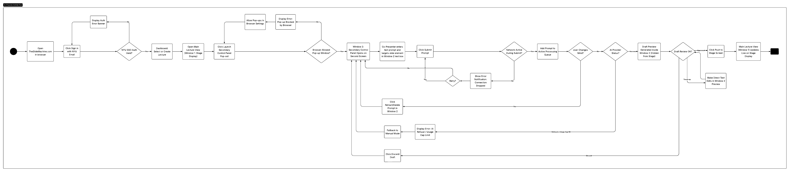
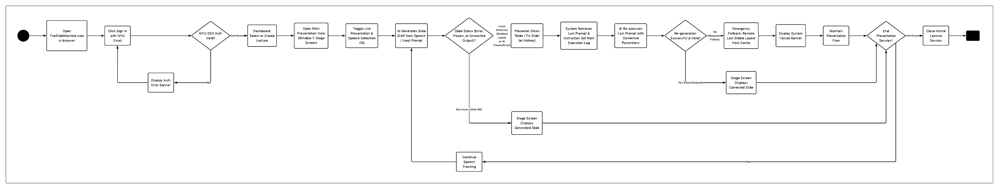

# Specification Phase Exercise

A little exercise to get started with the specification phase of the software development lifecycle. In this exercise, your team specifies a set of improvements and new features for [The Slide Machine](https://theslidemachine.com) — see the [instructions](instructions.md) for detail, and the [background](background.md) for an introduction to the software product you are tasked with extending.

## Team members

Nishika: https://github.com/nishikagorla
Nihal: https://github.com/NISUN05
Pranay: https://github.com/PranayEng
Asri: https://github.com/scanfasri
Adil: https://github.com/ai2652-png

## Review of the Current Application

### Strengths

- **Strength - Organizing raw input:** When we gave the application messy and unstructured notes with repeated ideas and mistakes while speaking, it organized it into a coherent presentation and removed much of the unnecessary repetition.

- **Strength - Slide organization:** The application does a good job of deciding when information should be separated into different slides instead of putting everything on one slide.

- **Strength - Consistent formatting:** The slides it generates have a consistent visual style, with uniform fonts, colors, spacing, and formatting.

### Weaknesses

- **Weakness - Treats uncertain information as fact:** When we intentially said "I think around 1,000 students study abroad each year," it presented the number as a definite fact instead of preserving the uncertainty.

- **Weakness - AI embellishment:** When only said that NYU dining hall food is good, it expanded this into claims about "high-quality food options across campus locations." We never provided that in our input, so the AI seems to introduce unsupported details.

- **Weakness - Processing delay during rapid input:** When we spoke quickly and provided a lot of information, the application took time to process and generate the slides. This noticeable delay can be a hindrance during live presentations.

### Gaps

- **Gap - Speaker notes:** There doesn't seem to be an option to generate or write speaker notes for users who want to add notes to help them present the deck later.

- **Gap - Chart generation:** When we provided numerical data comparing NYU’s global locations, the app kept the information as text rather than generating a chart. Adding automatic chart generation would make this type of information easier to present visually.

- **Gap - Advanced layout editing:** There is limited control over the individual layout of a slide. Users can change the overall template, but there's no advanced editor for freely moving, resizing, or repositioning individual elements on the slides.

- **Gap - Dedicated correction workflow:** There is no dedicated interface where users can type specific changes they want the AI to make to the slides. Adding a written feedback field would allow users to describe changes directly without having to manually correct the slides themselves or provide additional spoken input.

## Prior Art & Originality

See instructions. Delete this line and replace with a short statement of what your team checked (the project's Future Work and Open Questions, its roadmap, and its open issues and pull requests) and which parts of your proposal are original — new work not already specified, scheduled, or proposed by someone else.

## Stakeholders

### User Type 1: Student

#### Stakeholder Profile: Annalise (Student)

* **Goals & Needs:**
  1. **Lecture Focus:** A tool that allows her to remain fully engaged with the presenter instead of constantly switching focus between listening and note-taking.
  2. **Automated Transcription:** Real-time speech-to-text functionality that accurately captures spoken lecture content.
  3. **Streamlined Slide Creation:** A fast, low-effort process for converting spoken or written concepts into complete slide decks.
  4. **Automated Formatting:** Intelligent layout and design capabilities that make slides look visually appealing without manual adjustment.

* **Problems & Frustrations:**
  1. **Transcription Inaccuracy:** When speaking from a script, the AI missed critical details and key information.
  2. **Broken Visual Layouts:** Formatting issues disrupted the output (e.g., her title slide truncated halfway through the title with `...`).
  3. **Pacing & Latency Friction:** Forced to pause repeatedly while speaking to allow the AI to catch up and generate slides, disrupting her speaking flow.
  4. **Usability Barriers:** Found the overall navigation and user interface unintuitive to operate during testing.

* **User Testing Observations:**
  * Observed noticeable pauses during live presentation input due to real-time AI processing delay.
  * Encountered UI rendering bugs on longer titles, leading to visual truncation.

---

### User Type 2: Instructor

#### Stakeholder Profile: Raj (Instructor)

* **Goals & Needs:**
  1. **Minimalist UI:** A clean, distraction-free interface that is easy to navigate during live instruction.
  2. **Cost & Experience:** Ad-free experience with transparent, open access for educational settings.
  3. **Maintainability & Extensibility:** A platform actively developed with a clear roadmap for future updates and features.
  4. **Hands-Free Operation:** Speech-driven control options that allow him to teach without being tied to a keyboard.

* **Problems & Frustrations:**
  1. **Lack of Session Controls:** Live recording/generation initiated immediately upon launch without a manual "Start" toggle, offering no preparation window.
  2. **Data & Privacy Concerns:** Expressed concern over data exposure after noticing other users' project titles and student names visible in the app interface.
  3. **Over-Reliance on AI:** Preferred a robust core slide-building application with *optional* AI integration, rather than a app centered entirely around automated generation.
  4. **Poor AI Synthesis & Context:** The app merely copied and pasted spoken words verbatim onto slides rather than summarizing, synthesizing, or expanding upon the material.
  5. **Irrelevant Media Generation:** The automated image feature fetched inaccurate and contextually mismatched images based on spoken input.

* **User Testing Observations:**
  * Experienced immediate friction upon landing on the interface due to auto-initiating live mode.
  * Expressed strong security concerns regarding student data visibility in public dashboards.

## Product Vision Statement

Our team is enhancing The Slide Machine by introducing a discreet secondary controller feature that allows a co-presenter to send direct text prompts to the AI in real time, eliminating errors caused by missed or misheard verbal cues while keeping the audience's view completely seamless and professional.

## User Requirements

See instructions. Delete this line and place a list of your User Stories here, grouped by type of user. These should describe functionality that is new or changed, not functionality the app already has.

## Activity Diagrams

### Co-Presenter Workflow(1)

#### User Story
As a Co-Presenter, I want to send direct text prompts through my secondary control panel while the main speaker is talking, so that I can silently provide missing terminology or key facts to the AI without forcing the speaker to pause.

[Link](https://lucid.app/lucidspark/4ef88773-2451-4fc7-9989-e1650afa9442/edit?viewport_loc=1992%2C-2508%2C2048%2C1036%2C0_0&invitationId=inv_560e05f6-d7e0-431f-b126-4e81e6e6cdc3)

### Main Presenter Workflow(1)

#### User Story
As a Main Presenter, I want the system to automatically trigger a rollback to the last stable layout if an AI generation fails or encounters rendering errors, so that my audience never sees a broken presentation screen on stage.

#### Activity Diagram
[Link](https://lucid.app/lucidchart/9ee911ec-7760-4c7a-a04a-885810ab89ce/edit?viewport_loc=-1851%2C-1635%2C8863%2C5267%2C0_0&invitationId=inv_bfa26cde-c94e-4f0e-8cc5-0f9137e35916)

## Wireframes

See instructions. Delete this line and place your wireframe diagrams here, covering every new screen and every existing screen your proposal changes, for every type of user.

## Clickable Prototype

See instructions. Delete this line and place a publicly-accessible link to your clickable prototype here.

## Stakeholder Demo

See instructions. Delete this line and place a link to the deck The Slide Machine generated during your presentation here, after you have presented.

## Exit Ticket

See instructions. Delete this line and place a link to the exit-ticket quiz you generated from your demo deck and distributed to the class, along with a short note on what — if anything — you had to correct in the generated questions before publishing.
